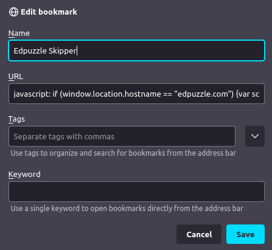

# Edpuzzle Video Skipper 


Follow the steps below to use the skipper

Note: This project is being used in [Edpuzzle Answers](https://github.com/ading2210/edpuzzle-answers). 

Thanks to [@ading2210](https://github.com/ading2210) for cleaning up the code and making it a lot more readable on v2.1!

## Add the bookmarklet

Copy the following code and make it a bookmarklet



To make a bookmarklet, simply create a new bookmark, name it whatever you want, and then paste the code below into the url box.

```javascript
javascript: if (window.location.hostname == "edpuzzle.com") {
    var script = document.body.appendChild(document.createElement("script"));
    script.src = "https://cdn.jsdelivr.net/gh/ASmallYawn/EdpuzzleSkipper@2.1/script.js";
    script.remove();
} else {
    alert("Please run this on https://edpuzzle.com/assignments/[assignment_id]/watch")
}
```

## Usage

Simply go to any EdPuzzle assignment, a link like this (https://edpuzzle.com/assignments/[assignment_id]/watch), and click the bookmarklet.


## License
[GPL-3.0](https://choosealicense.com/licenses/gpl-3.0/)

Please star if you enjoy it :)

ඞ sussy balls